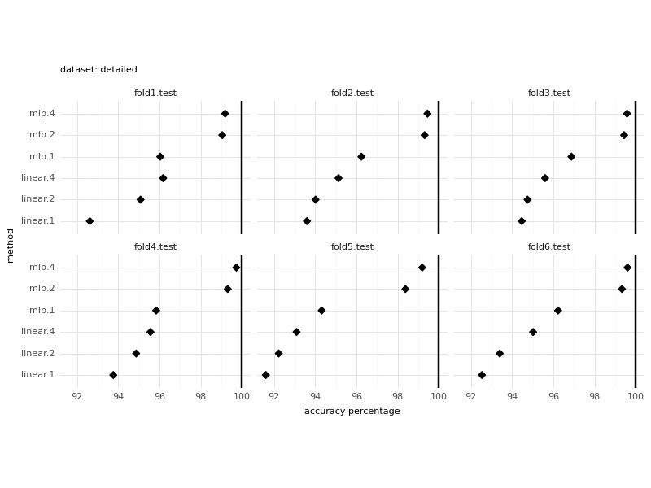
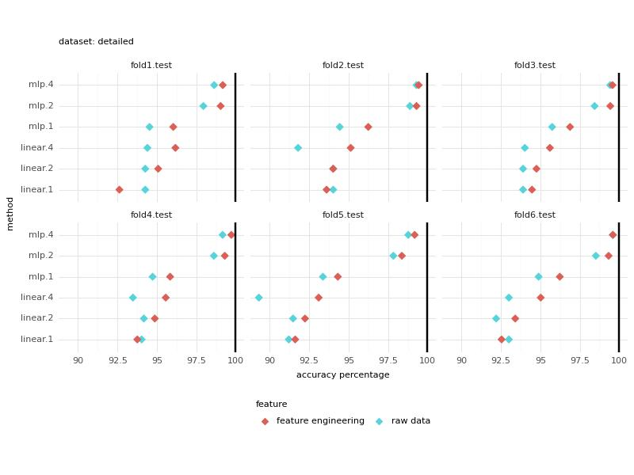
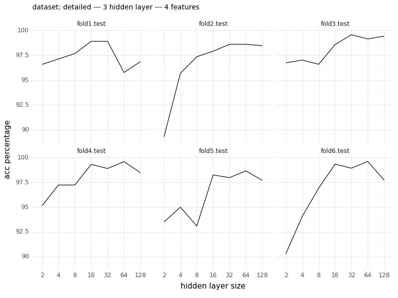
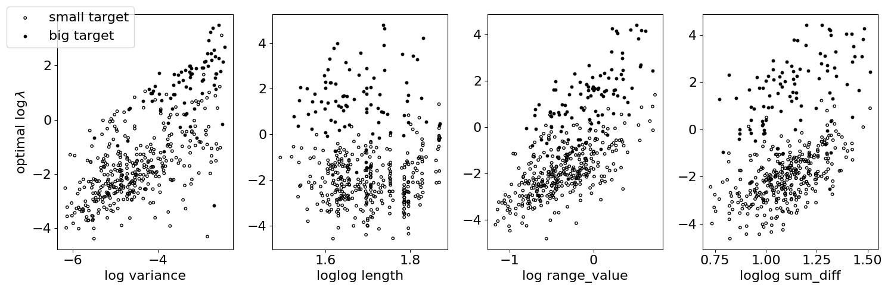

# Changepoint detection penalty learning

## Folders:
- **`acc_rate`:** Contains CSV files detailing the accuracy rates for each implemented method.
- **`figures`:** Holds figures generated.
- **`training_data`:** Consists of data for training pertaining to error counts for each lambda, sequence features, and target intervals.

## Python Files:
- **`utility_functions.py`:** Collection of utility functions.
- **`BIC.py`:** Implements the computation of log_lambda using the Bayesian Information Criterion (BIC) approach.
- **`MLP.py`:** Implements learning log_lambda from a set of sequence features using a Multi-Layer Perceptron (MLP) approach.
- **`main.py`:** Serves as the main entry point, responsible for generating accuracy rate files in the `acc_rate` folder.

## Generating Figures from Scratch:
- Accuracy Rate Comparison figure:
  - Run `main_MLP.py` to generate a CSV file containing accuracy rates for each method. Add new methods if necessary (running `main_BIC.py` and `main_L1reg.py`).
  - Execute `figure_acc_compare.ipynb`, `figure_feature_engineer_compare.ipynb`, `figure_mlp_compare.ipynb`, `figure_features_target.ipynb`. The resulting figure will be generated in the `figures` folder.
    
    
    
    
